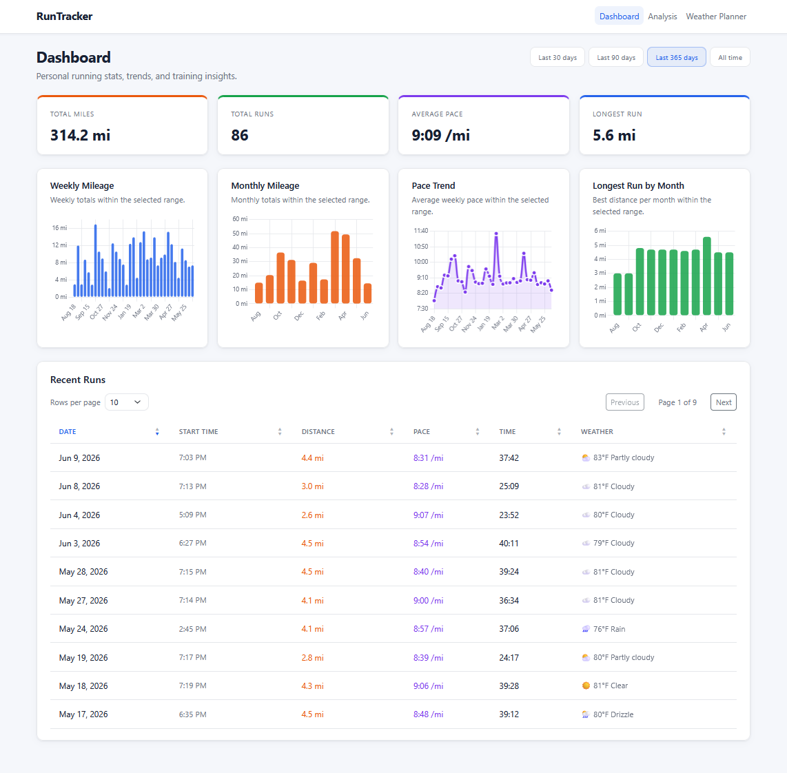
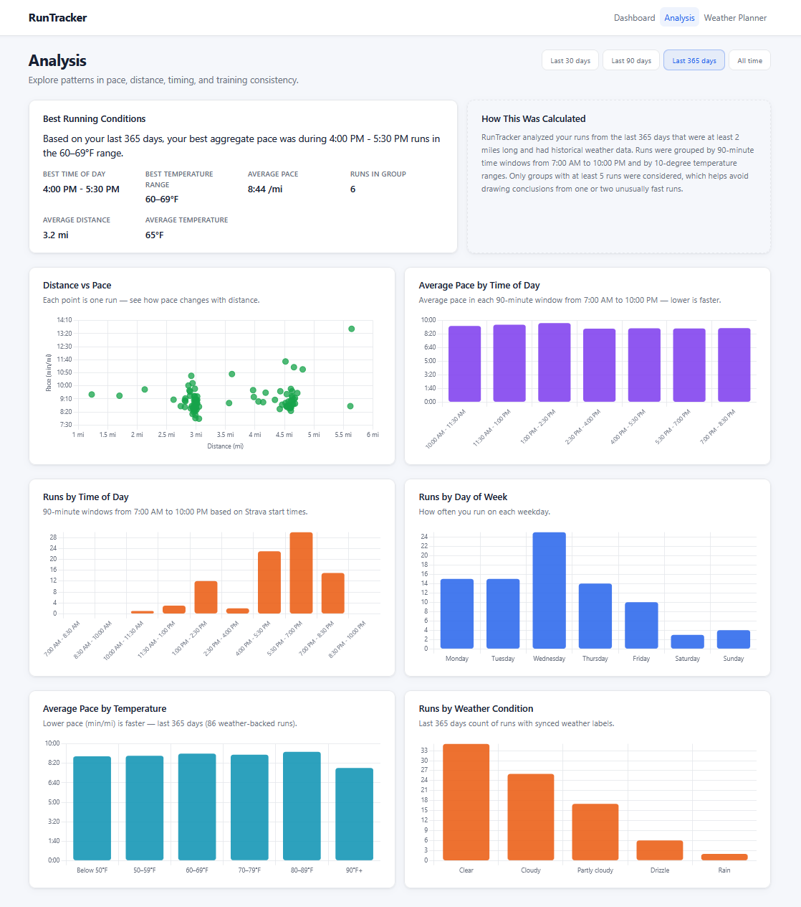
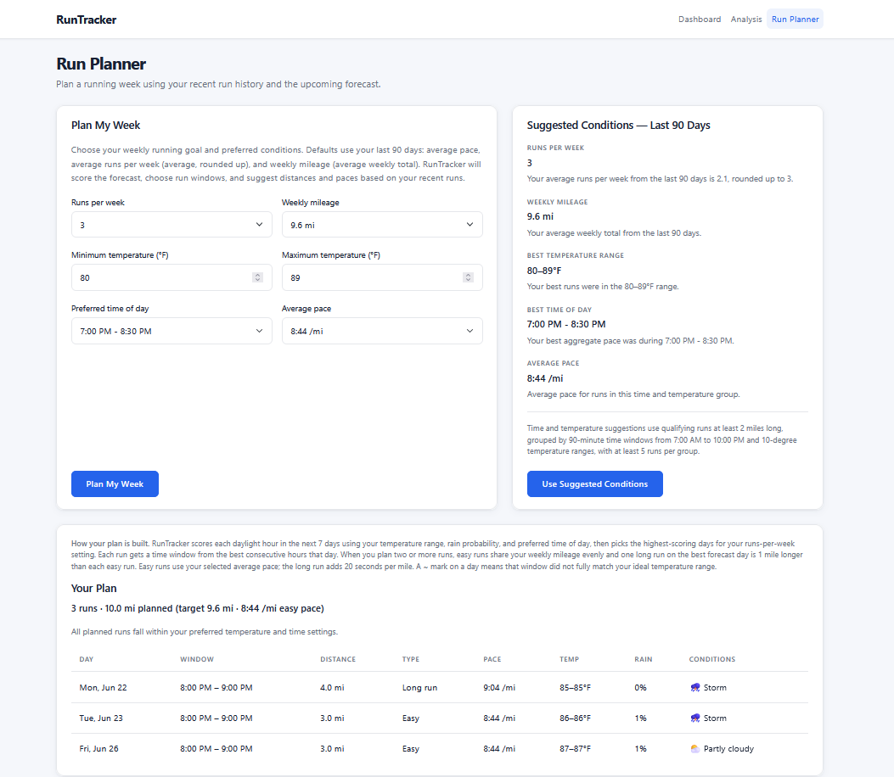
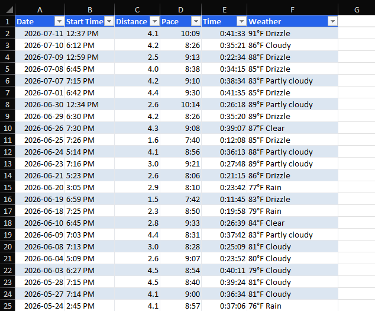
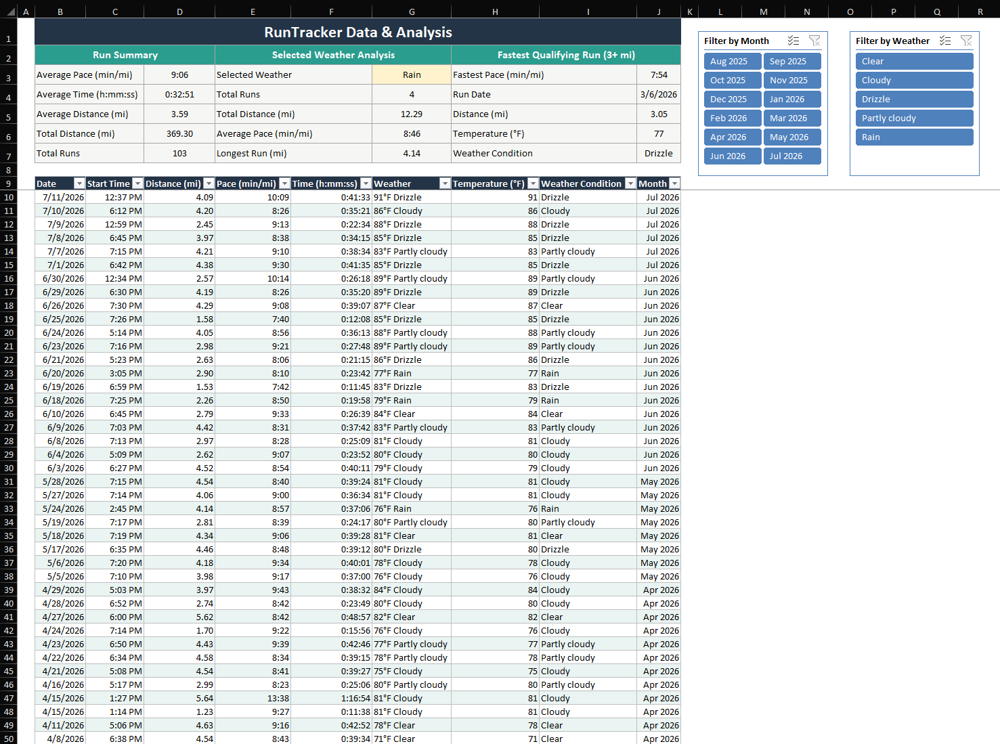
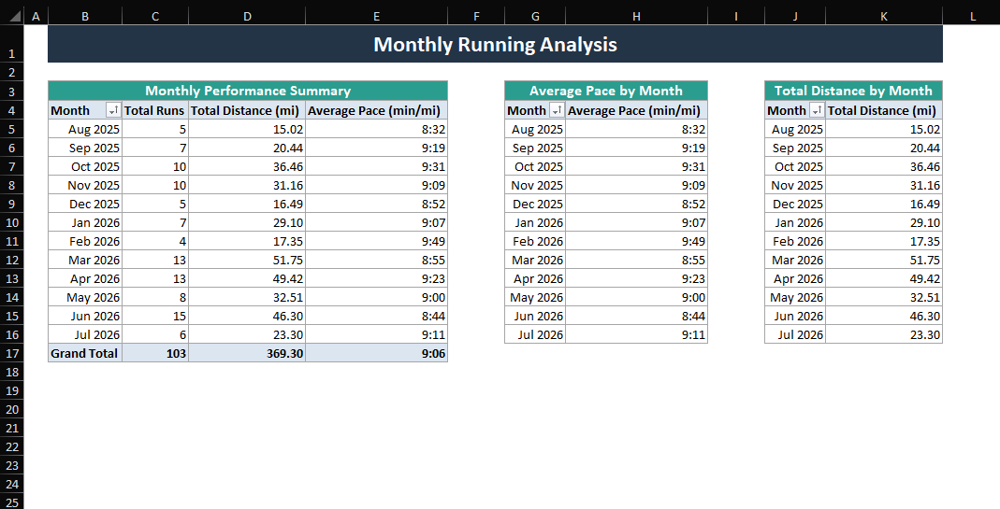
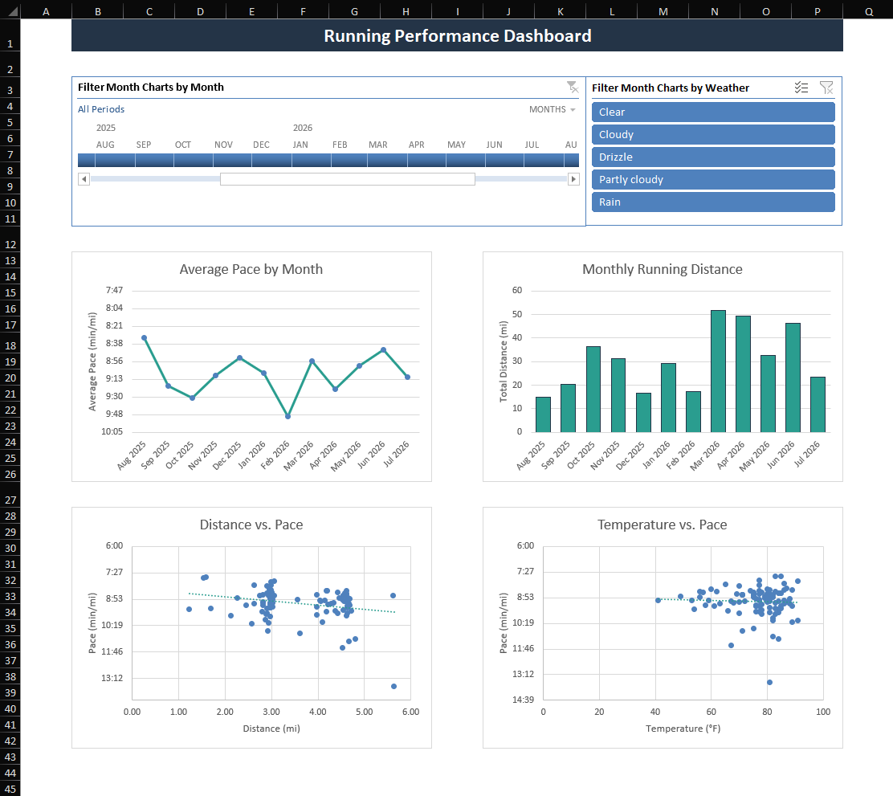

# RunTracker

**Live site:** [https://runtracker-lirm.onrender.com/](https://runtracker-lirm.onrender.com/)

RunTracker is a personal running analytics app I built to better understand my own training data. I started running in August 2025 and have been recording my runs with an Apple Watch, with Strava storing detailed activity metrics like distance, pace, time, elevation, and run history. This app pulls that running data together with historical weather data for each run, then uses dashboards, charts, and analysis tools to help identify patterns in my performance and make better decisions about future runs.

The current version includes a filterable running dashboard, a full run history table, weather-based performance analysis, and a Run Planner that uses recent running history and forecast data to recommend a weekly run plan.

## Data Pipeline

RunTracker is built around a simple data workflow: pull run activity from the Strava API, clean and store it in SQLite, add historical weather from the Open-Meteo API to each run, then export the combined dataset for Excel analysis.

### 1. Strava activity data

Runs are synced from the Strava API. Raw fields like distance in meters and moving time in seconds are converted into miles, pace per mile, and a readable duration before insert.

Sample activity object:

```json
{
  "id": 12345678901,
  "name": "Morning Run",
  "type": "Run",
  "sport_type": "Run",
  "distance": 8046.72,
  "moving_time": 2400,
  "start_date": "2026-07-29T12:05:00Z",
  "start_date_local": "2026-07-29T07:05:00Z",
  "total_elevation_gain": 12.3,
  "start_latlng": [29.9511, -90.0715]
}
```

After cleaning, that becomes a SQLite row with values such as `distance_miles`, `pace_per_mile`, `pace_seconds`, `moving_time`, local start time fields, elevation, and start coordinates.

### 2. Open-Meteo weather data

For each stored run, historical hourly weather is requested from Open-Meteo using the run date and start coordinates. The app matches the hour closest to the run start and stores temperature, humidity, wind, precipitation, and a weather condition label derived from the WMO weather code.

Sample historical response:

```json
{
  "hourly": {
    "time": ["2026-07-15T00:00", "2026-07-15T07:00"],
    "temperature_2m": [78.0, 76.0],
    "relative_humidity_2m": [85, 82],
    "precipitation": [0.0, 0.0],
    "weather_code": [2, 0],
    "wind_speed_10m": [4.5, 5.0]
  }
}
```

A separate forecast endpoint supplies the next 7 days of hourly and daily data for the Run Planner. That forecast path is used for planning, not for adding weather to past runs.

Sample forecast response:

```json
{
  "hourly": {
    "time": ["2026-07-29T07:00", "2026-07-29T08:00"],
    "temperature_2m": [72.5, 74.0],
    "precipitation_probability": [10, 20],
    "precipitation": [0.0, 0.01],
    "weather_code": [1, 61],
    "relative_humidity_2m": [80, 78],
    "wind_speed_10m": [5.2, 6.0]
  },
  "daily": {
    "time": ["2026-07-29"],
    "sunrise": ["2026-07-29T06:12"],
    "sunset": ["2026-07-29T19:48"]
  }
}
```

### 3. Combined export and Excel analysis

Once Strava runs and historical weather are joined in SQLite, the Run Log "Export to Excel" button downloads a flat workbook with Date, Start Time, Distance, Pace, Time, and a combined Weather field. That raw file is the starting point for the Excel work shown below.

The finished workbook (available from the Excel Export button in the nav) builds on that export with helper columns, summaries, PivotTables, charts, and slicers. The screenshots in the Excel section walk through that cleaned and analyzed version of the same dataset.

## Screenshots

### Dashboard

The Dashboard summarizes running volume, pace, long runs, weekly mileage, monthly mileage, and recent runs with filtering, sorting, and pagination.



### Analysis

The Analysis page explores performance patterns by distance, weekday, time of day, and temperature, plus Best Running Conditions when enough weather-backed data exists.



### Run Planner

The Run Planner uses forecast data and recent running patterns to recommend a weekly run plan with suggested days, time windows, distances, run types, and paces.



### Excel

#### Raw Data



The raw Excel data can be exported directly from the Run Log page on the RunTracker website using the "Export to Excel" button. It includes the original Date, Start Time, Distance, Pace, Time, and Weather fields before any summaries, PivotTables, charts, slicers, or helper columns are added. I used this file as the starting point for cleaning and organizing the data. The completed Excel workbook, which includes the added summaries, Pivot Analysis sheet, and Dashboard, can be downloaded using the Excel Export button at the top of the page.

#### Runs



I exported the run data from RunTracker into Excel using the "Export to Excel" button on the Run Log table and converted it into an Excel Table so the filters, formulas, and formatting stay consistent. Since the weather data came in as one value, such as "91°F Drizzle," I split it into separate Temperature and Weather Condition columns. I also added a Month column so the data sorts correctly by month and year.

Above the table, I added a Run Summary that shows average pace, average time, average distance, total distance, and total runs. The summary uses SUBTOTAL, so it updates when the Month or Weather Condition slicers are used. I also added a weather analysis section with COUNTIFS, SUMIFS, AVERAGEIFS, and MAXIFS, along with a Fastest Qualifying Run section that uses MINIFS and XLOOKUP.

#### Pivot Analysis



I used PivotTables to summarize the run data by month, including total runs, total distance, and average pace. The main PivotTable includes a Grand Total row for the full dataset.

I also created separate monthly PivotTables for average pace and total distance. These are used as the data sources for the matching charts on the Dashboard and keep the chart setup simple and organized.

#### Dashboard



The Dashboard includes four charts: Average Pace by Month, Monthly Running Distance, Distance vs. Pace, and Temperature vs. Pace. The monthly charts are connected to PivotTables, while the scatter charts use the individual rows from the RunLog table.

The pace axes are reversed so faster times appear higher on the charts. The Dashboard also includes a Month Timeline and Weather Condition slicer for the monthly charts, while the slicers on the Runs sheet control the source table, Run Summary, and scatter charts.

## Features

- **Dashboard** — stat cards, charts, date-range filters (Last 30 days, Last 90 days, Last 365 days, All time), and **Shoe Mileage** tracker
- **Excel Export** — downloadable cleaned workbook with helper columns, summaries, PivotTables, charts, and slicers
- **Run Log** — sortable, paginated runs table with weather display and raw **Export to Excel**
- **Analysis** — performance charts by distance, timing, and temperature, plus **Best Running Conditions** insights
- **Run Planner** — recommends a weekly run plan using forecast data and recent running history, including suggested days, time windows, distances, run types, and paces
- **Suggested Conditions — Last 90 Days** — uses Best Running Conditions to pre-fill preferred temperature and time settings on the Run Planner

## Tech Stack

- Python
- Flask
- SQLite
- HTML
- CSS
- JavaScript
- Chart.js
- Strava API
- Open-Meteo API
- Gunicorn
- Render
- Git / GitHub

## Chart Methodology

### Dashboard

| Chart | Calculation | Chart type |
|-------|-------------|------------|
| **Weekly Mileage** | Sum of `distance_miles` per week; week starts Monday | Column |
| **Monthly Mileage** | Sum of `distance_miles` per calendar month | Column |
| **Longest Run by Month** | Maximum single-run `distance_miles` per calendar month | Column |
| **Pace Trend** | Mean `pace_seconds` per week (Monday week start) | Line |

### Analysis

| Chart | Calculation | Chart type |
|-------|-------------|------------|
| **Distance vs Pace** | One point per run: distance vs `pace_seconds` | Scatter |
| **Average Pace by Distance Bucket** | Runs grouped into mutually exclusive distance buckets (0–2, 2–3, 3–4, 4–5, 5–6, 6+ mi); mean `pace_seconds` per bucket | Column |
| **Distance Distribution** | Count of runs per distance bucket | Column |
| **Runs by Day of Week** | Count of runs per weekday | Column |
| **Runs by Time of Day** | Count of runs per 90-minute start-time window (7:00 AM – 10:00 PM) | Column |
| **Average Pace by Time of Day** | Mean `pace_seconds` per same time-of-day bucket | Column |
| **Pace vs Temperature** | One point per weather-backed run: temperature vs `pace_seconds` | Scatter |
| **Average Pace by Temperature** | Weather-backed runs grouped into 10°F temperature buckets; mean `pace_seconds` per bucket | Column |

## Run Planner

RunTracker scores each daylight hour in the next 7 days using your temperature range, rain probability, and preferred time of day, then picks the highest-scoring days for your runs-per-week setting. Each run gets a time window from the best consecutive hours that day. When you plan two or more runs, easy runs share your weekly mileage evenly and one long run on the best forecast day is 1 mile longer than each easy run. Easy runs use your selected average pace; the long run adds 20 seconds per mile. A **~** mark on a day means that window did not fully match your ideal temperature range.

## Local Development Setup

1. **Create a virtual environment**

   ```bash
   python -m venv .venv
   .venv\Scripts\activate   # Windows
   # source .venv/bin/activate   # macOS/Linux
   ```

2. **Install dependencies**

   ```bash
   pip install -r requirements.txt
   ```

3. **Configure environment variables**

   Copy `.env.example` to `.env` and set at least `FLASK_SECRET_KEY`.

   For local Strava sync development, also set:

   - `STRAVA_CLIENT_ID`
   - `STRAVA_CLIENT_SECRET`
   - `STRAVA_REDIRECT_URI`
   - `ENABLE_STRAVA_ROUTES=true`

   OAuth tokens are stored in the local SQLite database after you connect. Do not paste tokens into `.env`.

4. **Run the app**

   ```bash
   python app.py
   ```

   Open [http://127.0.0.1:5000/](http://127.0.0.1:5000/).

5. **Connect Strava and sync runs** (local development only)

   With `ENABLE_STRAVA_ROUTES=true`, visit [http://127.0.0.1:5000/strava/connect](http://127.0.0.1:5000/strava/connect), authorize the app, then run the sync scripts described in [Updating Run Data](#updating-run-data).

## Updating Run Data

Because the live version uses `public_runtracker.db`, run data updates require regenerating the sanitized public database locally and pushing it to GitHub.

1. **Sync new Strava activities**

   ```powershell
   python sync_strava.py
   ```

2. **Sync historical weather for newly imported runs**

   ```powershell
   python sync_weather.py
   ```

3. **Rebuild the sanitized public database**

   ```powershell
   python create_public_db.py
   ```

4. **Verify the public database is safe**

   ```powershell
   python verify_public_db.py
   ```

5. **Test locally with the public database**

   ```powershell
   $env:DATABASE_PATH="public_runtracker.db"
   $env:ENABLE_STRAVA_ROUTES="false"
   python app.py
   ```

6. **Commit and push the updated public database**

   ```powershell
   git status
   git add public_runtracker.db README.md
   git commit -m "Update public running data"
   git push
   ```

To update the data cutoff date shown in documentation, use the latest run date printed by `create_public_db.py`.

## Deployment Notes

- The app is deployed on [Render](https://render.com/).
- Start command: `gunicorn app:app`
- The live service should use:
  - `DATABASE_PATH=public_runtracker.db`
  - `ENABLE_STRAVA_ROUTES=false`
- Strava OAuth routes are disabled in the live version.
- The live version does not need Strava secrets because it uses the sanitized public database.

A `Procfile` is included for Render and similar platforms.

## Security Notes

- Do **not** commit `.env`
- Do **not** commit `runtracker.db`
- Do **not** commit private database backups
- Only `public_runtracker.db` should be committed as a database file
- Run `python verify_public_db.py` before committing an updated public database
- `public_runtracker.db` should not contain Strava tokens, OAuth tables, access tokens, refresh tokens, client secrets, or exact coordinates

## Future Improvements / To Do

- Add automatic daily Strava sync
- Add automatic weather sync after new runs are imported
- Add user accounts
- Allow users to connect their own Strava accounts
- Allow configurable weather location instead of hardcoded New Orleans
- Add admin-only sync controls
- Move to a production database if the app becomes multi-user
- Add tests for analysis and database helper functions
- Add more screenshots or demo GIFs if useful

## Optional Sample Data

For a quick demo without Strava, you can run `python seed_data.py` to populate sample runs. For real use, connect Strava and sync instead.
